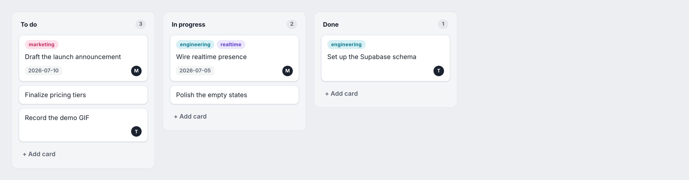
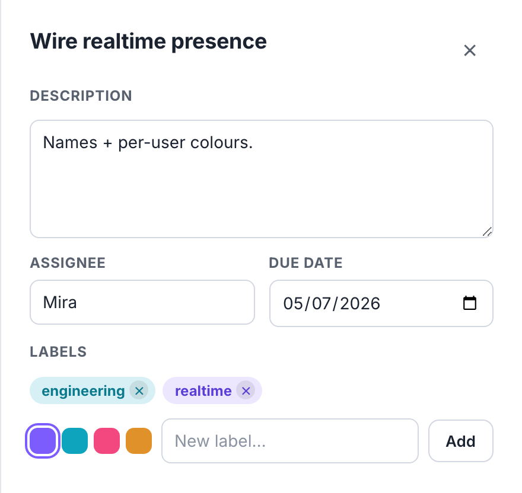

# Flowboard

[](https://flowboard-five-ochre.vercel.app)
[](https://github.com/eliegeorgioelkhoury/flowboard/actions/workflows/ci.yml)
[](LICENSE)

> Realtime multiplayer Kanban. Drag cards with spring physics and watch collaborators' live cursors move with their names. Optimistic updates, reconciled on server confirm.

### ▶︎ [Try the live demo →](https://flowboard-five-ochre.vercel.app)
No signup — drag cards, open a card's details, and open the link in a second tab to watch live cursors and presence.

**Status:** ✅ **Shipped & live** — milestones 1–7 complete (schema/RLS, board, realtime, card details, signature cursors, tests, deploy). CI green. See [STATE.md](STATE.md) · [ROADMAP.md](ROADMAP.md).

<!-- TODO: swap for a looping capture of two cursors dragging cards live; drop the file at docs/demo.gif -->
[](https://flowboard-five-ochre.vercel.app)

## Screenshots
<!-- Board + card-details are real captures. TODO: swap the remaining two — a live-cursors shot (docs/cursors.png) and a public-demo-board shot (docs/demo.png); they link to the live app meanwhile. -->
| Board | Live cursors | Card details | Public demo board |
|---|---|---|---|
| [](https://flowboard-five-ochre.vercel.app) | [](https://flowboard-five-ochre.vercel.app) | [](https://flowboard-five-ochre.vercel.app) | [](https://flowboard-five-ochre.vercel.app) |

## Features
- Drag & drop cards between columns with **dnd-kit** + **Framer Motion** spring physics.
- **Live presence:** per-user cursors with names and colors; a drag ghost when another user is dragging.
- Realtime row sync over Supabase channels; optimistic updates reconciled on server confirm.
- Card details: description, labels, assignee, due date.
- One **public demo board**, readable without signup.

## Stack
- **Frontend:** Next.js (App Router) · React · TypeScript · dnd-kit · Framer Motion
- **Backend:** Supabase — Postgres, Realtime, Auth, Row-Level Security
- **Tests:** Vitest (units) · Playwright (drag-and-drop)
- **CI:** GitHub Actions — typecheck, lint, unit tests, build, then a Playwright E2E against a **real Supabase** (`supabase start`)

## Architecture
```
Next.js (Vercel) ⇄ Supabase (Postgres + Realtime + Auth)
   server components → initial load
   client board      → Postgres change + presence/cursor channels
```
- Server components render the initial board; the client subscribes to row changes and to presence/cursor channels.
- RLS keeps each user scoped to their boards, while one demo board stays publicly readable.
- A **twice-weekly GitHub Actions cron** pings the Supabase project so the free tier never pauses.
- Milestone-by-milestone breakdown in [ROADMAP.md](ROADMAP.md).

## Run locally

```bash
git clone git@github.com:eliegeorgioelkhoury/flowboard.git && cd flowboard
npm ci
npm run dev            # http://localhost:3000
```

Without Supabase configured, the board renders from a **static seed** so you can preview the UI — drag/drop animates locally but nothing persists and there's no realtime. For the full experience (persistence, realtime row sync, presence cursors), point it at Supabase:

```bash
# Option A — local Supabase (needs Docker); applies migrations + seed automatically
supabase start
supabase status -o env          # copy API URL + anon key into .env.local

# Option B — a hosted Supabase project
cp .env.example .env.local      # fill in NEXT_PUBLIC_SUPABASE_URL + ANON_KEY
supabase db push                # apply supabase/migrations + seed
```

```bash
npm run typecheck      # tsc --noEmit
npm run lint
npm test               # Vitest units
npm run e2e            # Playwright drag-and-drop (expects a running Supabase + build)
```

## Deploy (Vercel + Supabase)

> Config lives in the repo; secrets live in the host dashboards — nothing secret is committed. The deploy itself (creating the project, pasting the values, pushing the schema) is a manual dashboard step, intentionally not automated.

**Vercel** — Next.js is zero-config here; [`vercel.json`](vercel.json) just pins `framework: nextjs` and `npm ci`. Set these under Project → Settings → Environment Variables (Production + Preview):

| Env var | Value |
|---|---|
| `NEXT_PUBLIC_SUPABASE_URL` | Supabase Project URL, e.g. `https://<ref>.supabase.co` |
| `NEXT_PUBLIC_SUPABASE_ANON_KEY` | Supabase anon / publishable (`sb_publishable_…`) key |

Both are browser-safe and are all the app needs — every read goes through the anon key + RLS, so there is **no service-role key** to configure.

**Supabase** — create a project, then apply `supabase/migrations/` + `supabase/seed.sql` (`supabase db push`, or paste into the SQL editor). RLS keeps every board private except the seeded **public demo board**, which is world-readable (and world-writable, by design, for the live demo) — reachable at `/` with no login.

**Keep-warm cron** — [`.github/workflows/keep-warm.yml`](.github/workflows/keep-warm.yml) does a one-row anon read of the demo board twice a week (Mon + Thu) so a free project never hits the ~7-day auto-pause. Add these under GitHub → Settings → Secrets and variables → Actions:

| Repo secret | Value |
|---|---|
| `SUPABASE_URL` | Supabase Project URL (same as above) |
| `SUPABASE_ANON_KEY` | anon / publishable key (same as above) |

## Project layout
```
flowboard/
├── app/          # Next.js App Router — server load + globals/tokens
├── components/   # board, cards, presence cursors, card detail panel
├── lib/          # Supabase client, realtime, board reducer, ordering, presence
├── supabase/     # SQL migrations + RLS policies + seed
├── tests/        # Vitest units (ordering, reducer, presence)
├── e2e/          # Playwright drag-and-drop spec
└── docs/         # demo GIF, screenshots
```

## License
[MIT](LICENSE) © 2026 Elie El Khoury
